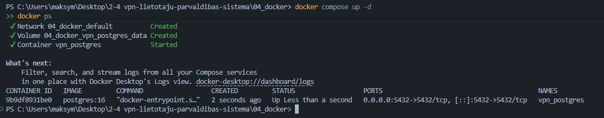

# 2-4 Weekly Report - Week 1

## Student Information

Student name: Maksym Durikhin
Group: PX24
Project ID: 2-4
Project name: VPN User Management System
Week number: 1

## Planned Work For This Week

Project setup, repository creation, requirements review, wireframes, database draft, Docker baseline.

## Completed Work

Project setup, repository creation, requirements review, wireframes, database draft, Docker baseline.

## GitHub Commits

1.1 Initial commit: c559553013736c36fb6821029066e3d9e69318f2
1.2 Documentation commit: c34ac4a91ac00eec1c7cd7b8e85d88e3a7342bb9
1.3 Week 1 main commit: 43b072581a770be0d3f4af052e1c0562d5d0541f

## Screenshots / Evidence

## Problems Found

Docker Desktop did not start correctly because the Docker Engine was not running.
When running docker compose up -d, the system could not connect to the Docker API. 

## Solutions Applied

The Docker issue was solved by checking the Windows virtualization and Docker environment configuration.
Once Docker Engine was running, Docker commands such as docker ps and docker compose up -d could be used correctly.

## Next Week Plan

- Weekly report file committed in 06_weekly_reports.
- Source code commits from the week.
- Screenshots or terminal output if relevant.
- Updated project board or issue list.
- Short summary of problems and solutions.

## Supervisor Notes

To be completed by the practice supervisor if needed.
