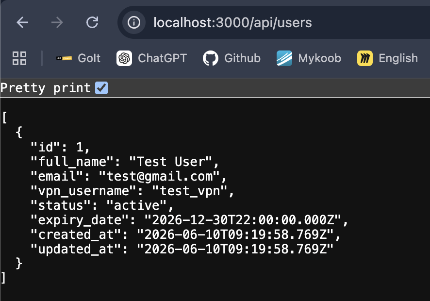

# 2-4 Weekly Report - Week 2

## Student Information

Student name: Maksym Durikhin
Group: PX24
Project ID: 2-4
Project name: VPN User Management System
Week number: 2

## Planned Work For This Week

Core database implementation, backend structure, first API endpoints, frontend skeleton, initial test cases.

## Completed Work

Core database implementation, backend structure, first API endpoints, initial test cases.

## GitHub Commits

2.1 Add database connection test evidence: aaab52189eb87b772b83dd6edb1e973dd0b20d63
2.2 Ignore Node.js dependencies and modules: d7e35afbdc39787e356aa68dc220a39f27196095

## Screenshots / Evidence

### Evidence
- [Backend Health Check](../07_screenshots_and_evidence/week_02_backend_health_check.md)
- [Create User Test](../07_screenshots_and_evidence/week_02_create_user_test.md)
- [Database Connection Test](../07_screenshots_and_evidence/week_02_database_connection_test.md)

### Screenshots
- 
- 
- 

## Problems Found

During Week 2, the main problems were related to backend setup and database connection.

The `npm run dev` command first used `nodemon` from the wrong folder, which caused a permission error. After that, `nodemon` also tried to start the backend with an extra file, so the server exited immediately.

There was also a PostgreSQL authentication problem because the backend was using the wrong database user.

## Solutions Applied

The backend was fixed by setting up `package.json` and dependencies inside the correct `backend` folder.

The start script was corrected to:

```text
nodemon app.js

## Next Week Plan

- Weekly report file committed in 06_weekly_reports.
- Source code commits from the week.
- Screenshots or terminal output if relevant.
- Updated project board or issue list.
- Short summary of problems and solutions.

## Supervisor Notes

To be completed by the practice supervisor if needed.
