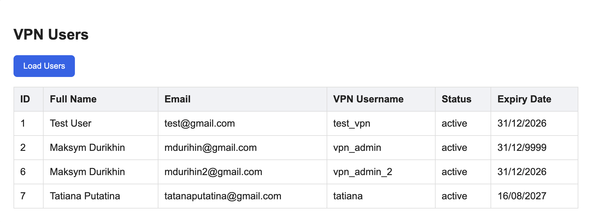
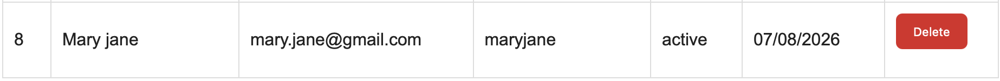
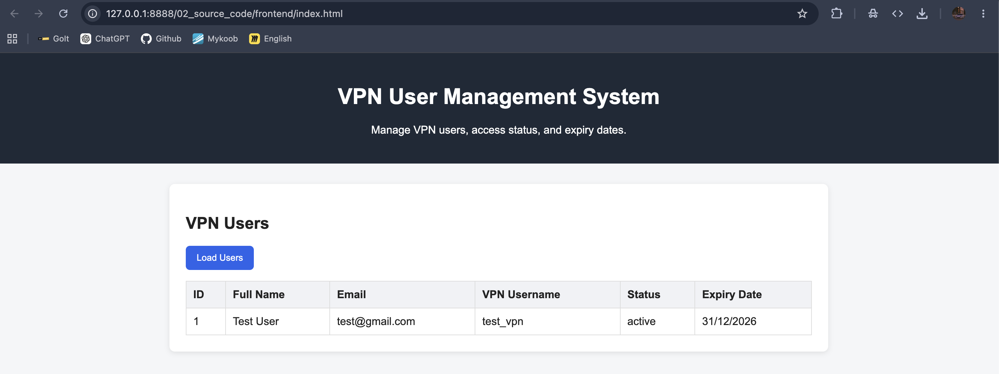

# 2-4 Weekly Report - Week 3

## Student Information

Student name: Maksym Durikhin
Group: PX24
Project ID: 2-4
Project name: VPN User Management System
Week number: 3

## Planned Work For This Week

Main feature implementation, validation, authentication if required, UI improvements, integration testing.

## Completed Work

Main feature implementation, validation, authentication if required, UI improvements, integration testing.

## GitHub Commits

3.1 Frontend: 64fa307a2cb54be69c77d3e31cc141c5bfd000fa
3.2 Integration tests: 8483e92cff595c1042938b0d2f27eeee069e8361

## Screenshots / Evidence

### Evidence: 
- [Validation Test](../07_screenshots_and_evidence/week_03/week_03_validation_test.md)
- [Frontend Integration](../07_screenshots_and_evidence/week_03/week_03_frontend_integration.md)
- [Create User Frontend](../07_screenshots_and_evidence/week_03/week_03_create_user_from_frontend.md)
- [Delete User Test](../07_screenshots_and_evidence/week_03/week_03_delete_user_test.md)

### Screenshots: 

## Problems Found

During Week 3, the main problems were related to frontend and backend integration.

The create user form initially returned a general error message, so it was not clear what caused the problem. Another issue was handling duplicate email or VPN username values, because these fields must be unique in the database.

There was also a need to make frontend error messages clearer for validation and database errors.

## Solutions Applied

The backend validation middleware was added to check user input before saving data.

Frontend error handling was improved so that API error messages are displayed more clearly to the user.

The create and delete actions were tested through the frontend and checked against the backend API and PostgreSQL database.

## Next Week Plan

- Weekly report file committed in 06_weekly_reports.
- Source code commits from the week.
- Screenshots or terminal output if relevant.
- Updated project board or issue list.
- Short summary of problems and solutions.

## Supervisor Notes

To be completed by the practice supervisor if needed.
