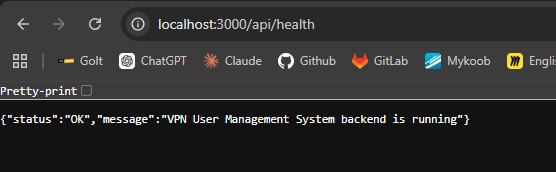

Week 2 Backend Health Check

Command used:
npm run dev

Terminal output:
Server is running on port 3000

Tested endpoint:
GET http://localhost:3000/api/health

Result:
Backend server started successfully and returned a JSON response.

