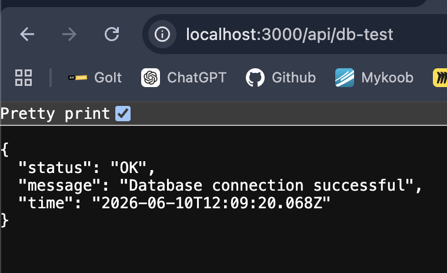

Week 2 Database Connection Test

Purpose:
This test checks if the Express backend can connect to the PostgreSQL database.

Backend command:
```
npm run dev
```

Tested endpoint:
GET http://localhost:3000/api/db-test

Expected result:
The backend returns a successful database connection message and current database time.

Result:
The backend successfully connected to the PostgreSQL database.

All objectives were successfully achieved. 


